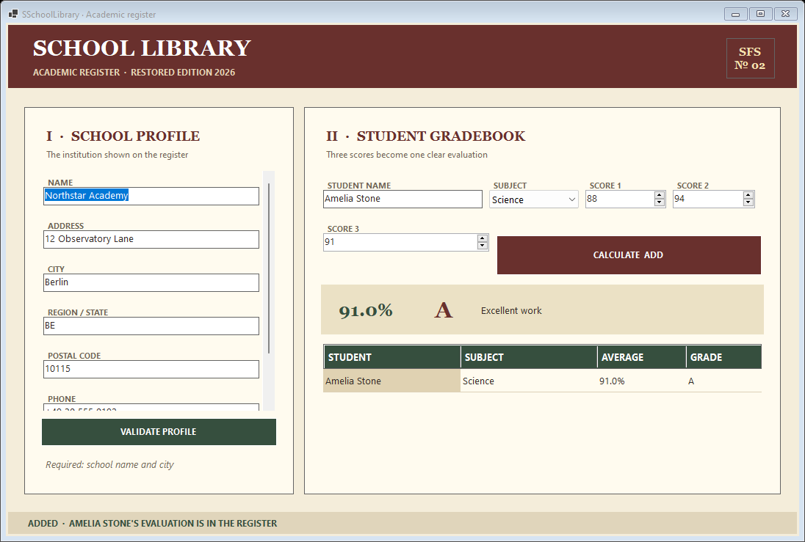

# SSchoolLibrary

[](https://github.com/sofoste93/SSchoolLibrary/actions/workflows/ci.yml)
[](https://github.com/sofoste93/SSchoolLibrary/releases/latest)
[](https://dotnet.microsoft.com/download/dotnet/8.0)

A small school register restored from a 2021 learning project. Version 2 keeps
the original Windows Forms spirit while replacing its fixed demo results with
real validation and grade calculations.



## Download for Windows

Open the [latest release](https://github.com/sofoste93/SSchoolLibrary/releases/latest),
download `SSchoolLibrary-Windows-x64.exe`, then launch it. It is self-contained:
the user does not need to install .NET.

Windows may show an “Unknown publisher” warning until the optional release
certificate is configured in the repository.

## What it does

- validates a small school profile;
- calculates the average of three scores from 0 to 100;
- converts the average into an A–F grade and a short comment;
- adds each result to a readable session register;
- keeps the interface compact, keyboard-friendly and deliberately vintage.

The register is intentionally temporary. Closing the application clears its
rows, which keeps this educational project simple and avoids storing personal
student information.

## Run the source

Requirements: Windows 10 or 11 and the [.NET 8 SDK](https://dotnet.microsoft.com/download/dotnet/8.0).

```powershell
dotnet run --project SchoolApp\SchoolFormApp\SchoolFormApp.csproj
```

Run the lightweight domain checks:

```powershell
dotnet run --project SchoolApp\SchoolLibrary.Checks\SchoolLibrary.Checks.csproj
```

Build the standalone executable:

```powershell
.\scripts\package.ps1
```

## Learning map

The solution separates responsibilities into three small projects:

- `SchoolLibrary` contains the school model and grading rules. It has no user-interface dependency.
- `SchoolFormApp` reads the controls, calls the library and presents the result.
- `SchoolLibrary.Checks` demonstrates the essential rules with dependency-free executable checks.

Start with `GradeService.cs`: it validates input, calculates the average, then
uses a switch expression to select the grade. Continue with `MainForm.cs` to see
how WinForms events call that reusable logic.

## Restored edition

Version 2.0.0 migrates the project from .NET Framework 4.7.2 to .NET 8, removes
committed build output, adds CI and creates a Windows-only self-contained
release. The original screenshots remain in `docs/legacy` as a small archive of
the 2021 interface.

Released under the [MIT License](LICENSE).
